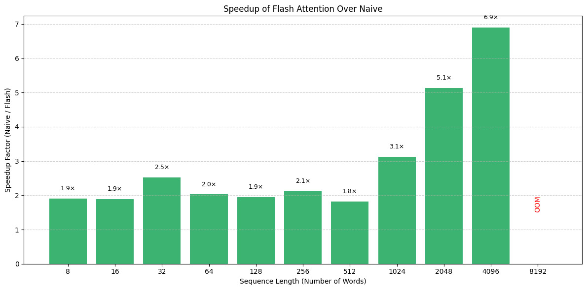
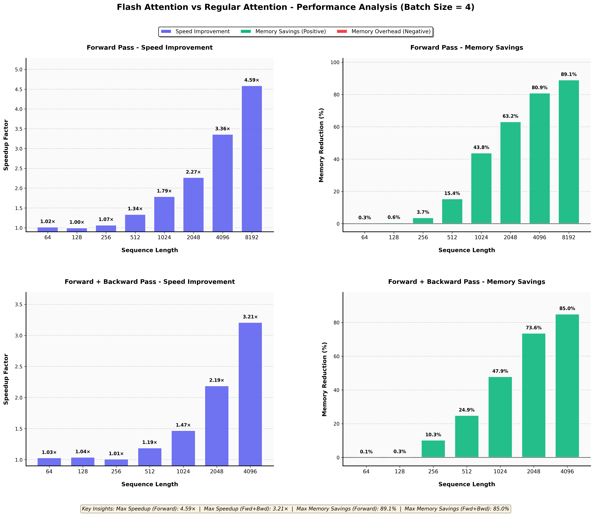

# FlashDeBERTa 🦾 – Boost inference speed by 3-5x ⚡ and run DeBERTa models on long sequences 📚.

**FlashDeBERTa** is an optimized version of the DeBERTa model leveraging flash attention to implement a disentangled attention mechanism. It significantly reduces memory usage and latency, especially with long sequences. The project enables loading and running original DeBERTa models on tens of thousands of tokens without retraining, maintaining original accuracy.

### Use Cases

DeBERTa remains one of the top-performing models for the following tasks:

- **Named Entity Recognition:** It serves as the main backbone for models such as [GLiNER](https://github.com/urchade/GLiNER), an efficient architecture for zero-shot information extraction.
- **Text Classification:** DeBERTa is highly effective for supervised and zero-shot classification tasks, such as [GLiClass](https://github.com/Knowledgator/GLiClass).
- **Reranking:** The model offers competitive performance compared to other reranking models, making it a valuable component in many RAG systems.

> [!warning]
> This project is under active development and may contain bugs. Please create an issue if you encounter bugs or have suggestions for improvements.

### Installation

First, install the package:

```bash
pip install flashdeberta -U
```

Then import the appropriate model heads for your use case and initialize the model from pretrained checkpoints:

```python
from flashdeberta import FlashDebertaV2Model  # FlashDebertaV2ForSequenceClassification, FlashDebertaV2ForTokenClassification, etc.
from transformers import AutoTokenizer
import torch

# Load tokenizer and model
tokenizer = AutoTokenizer.from_pretrained("microsoft/deberta-v3-base")
model = FlashDebertaV2Model.from_pretrained("microsoft/deberta-v3-base").to('cuda')

# Tokenize input text
input_text = "Hello world!"
input_ids = tokenizer(input_text, return_tensors="pt").input_ids.to('cuda')

# Model inference
outputs = model(input_ids)
```

In order to switch to eager attention implementation, initialise a model in the following way:
```python
model = FlashDebertaV2Model.from_pretrained("microsoft/deberta-v3-base", _attn_implementation='eager').to('cuda')
```

### Kernel Tuning ⚙️

FlashDeBERTa ships kernel parameters measured on an RTX 5060 Ti (BF16, head dim 64): the kernels are bound by position-score gathers, so small tiles with a single pipeline stage are fastest. If a configuration does not fit your GPU's shared memory, it is shrunk automatically at launch. You can override the defaults with environment variables:

```bash
# Configure forward pass (defaults: 64, 64, 1, 4)
export FLASHDEBERTA_FWD_BLOCK_M=64
export FLASHDEBERTA_FWD_BLOCK_N=64
export FLASHDEBERTA_FWD_NUM_STAGES=1
export FLASHDEBERTA_FWD_NUM_WARPS=4

# Configure both backward kernels (optional)
export FLASHDEBERTA_BWD_BLOCK_M=64
export FLASHDEBERTA_BWD_BLOCK_N=32
export FLASHDEBERTA_BWD_NUM_STAGES=1
export FLASHDEBERTA_BWD_NUM_WARPS=4

# Or one backward kernel: FLASHDEBERTA_BWD_KV_* (dK/dV, default 64, 32, 1, 4)
# and FLASHDEBERTA_BWD_Q_* (dQ, default 16, 64, 1, 4)

python train.py
```

Or set them directly in Python before the first forward pass:
```python
import os
os.environ['FLASHDEBERTA_FWD_BLOCK_M'] = '64'
os.environ['FLASHDEBERTA_FWD_BLOCK_N'] = '64'
os.environ['FLASHDEBERTA_FWD_NUM_STAGES'] = '1'
os.environ['FLASHDEBERTA_FWD_NUM_WARPS'] = '4'

from flashdeberta import FlashDebertaV2Model
```

**Note:** All four parameters of a group must be set together to take effect. Typical values: BLOCK_M/N ∈ {16, 32, 64, 128}, num_stages ∈ {1, 2, 3}, num_warps ∈ {4, 8}.

### Benchmarks

While context-to-position and position-to-context biases still require quadratic memory, our flash attention implementation reduces overall memory requirements to nearly linear. This efficiency is particularly impactful for longer sequences. Starting from 512 tokens, FlashDeBERTa achieves more than a 50% performance improvement, and at 4k tokens, it's over 5 times faster than naive implementations.



Below, you can find a breakdown of inference and training speed gains together with growing memory efficiency for the [DeBERTa-based model](https://huggingface.co/knowledgator/gliclass-small-v1.0) evaluated during inference and training on different batch sizes and sequence lengths.


### Future Work

- Train DeBERTa models on 8,192-token sequences using high-quality data.
- Integrate FlashDeBERTa into GLiNER and GLiClass.
- Train multi-modal DeBERTa models.

